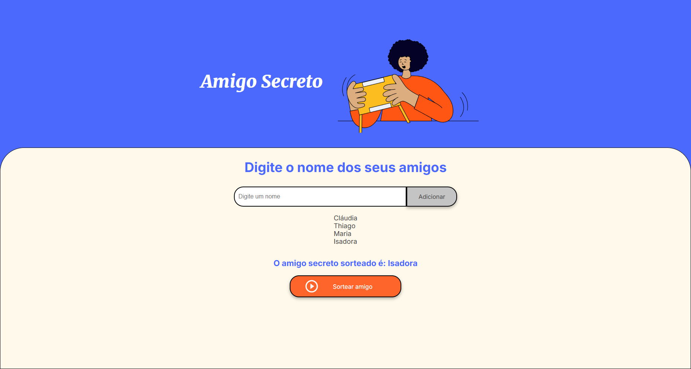

## Descrição do Projeto

Este é um projeto simples e interativo que permite gerenciar uma lista de amigos para um sorteio de amigo secreto. A aplicação permite aos usuários inserir nomes de amigos em uma lista e logo realizar um sorteio para determinar quem é o amigo secreto.

## Preview do Projeto

## Funcionalidades e Demonstração da Aplicação

- **Adicionar nomes:** Insira os nomes dos participantes na lista.
- **Listar participantes:** Visualize todos os amigos adicionados.
- **Sortear amigo secreto:** Realize o sorteio aleatório de um amigo da lista.

## Tecnologias Utilizadas

- **HTML5:** Estrutura básica da página.
- **CSS3:** Estilização da interface.
- **JavaScript (ES6):** Lógica para manipulação de DOM e funcionalidades interativas.

## ❤️ Contato
claudiacostapaniago@gmail.com
